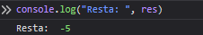

# Practica 1
-------------
Esta práctica consistió en crear una página HTML muy básica con estilos y archivos JS para ejecutar algunas funciones.

## Cómo ver la práctica
-----
Para ver la práctica solo hay que descargar los archivos y ejecutar Live Server de Visual Studio. Además, hay que abrir el "inspeccionar" de Chrome para poder ver ña sañoda de las funciones de JS

Giselle- Miembro 2
Eli- Miembro 3
Alejandro- Miembro 1
